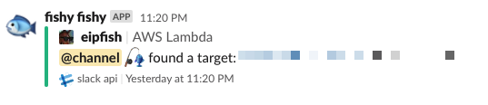

# EIP Fishing

This is an AWS Lambda that runs a small Go binary on a schedule. 
Each execution of the binary will allocate an Elastic IP (EIP) in the region you specify. 
It checks for historical records using the [Shodan API](https://developer.shodan.io/api).
It then checks [Disclose.io](https://disclose.io) for any potential bounties.

If there are any matches, it retains the EIP for further use, otherwise it releases the allocation back to the pool.

## Setup

Make sure you provide your own `.env` file with following keys:    

    WEBHOOK_URL="<your own incoming webhook URL for Slack>"
    SHODAN_API_KEY="<paid subscription to Shodan>"

Install serverless:

    npm install serverless -g

Deploy using your own AWS environment:

    make deploy

Monitor via slack:

## tl;dr

This is a simple lambda that I am using to help discover dangling NS records related to AWS EIPs for bug bounty programs.
